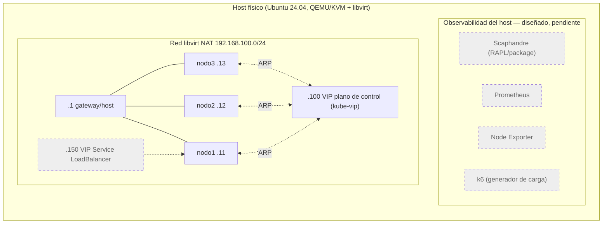

# Evaluación experimental de eficiencia energética y rendimiento en clústeres de Alta Disponibilidad con K3s y MicroK8s

Proyecto de título — Ingeniería Civil Informática, Universidad Católica de Temuco.
Autor: José Ignacio Delpino Muñoz.

Este repositorio contiene la infraestructura como código (Terraform + Ansible) y la documentación técnica del proyecto. La Etapa 1 (problema y requerimientos) y la Etapa 2 (diseño técnico) fueron cerradas y entregadas; este README documenta el estado de implementación al 30 de septiembre de 2026, sus decisiones técnicas y las desviaciones respecto al diseño original.

## 1. Resumen

El proyecto compara dos distribuciones ligeras de Kubernetes — K3s y MicroK8s — configuradas en Alta Disponibilidad (3 nodos), bajo un mismo host físico con recursos limitados, evaluando el consumo energético del host y el rendimiento de ambas plataformas bajo carga controlada. Cada distribución se aprovisiona, evalúa y destruye de forma independiente: nunca corren ambas al mismo tiempo, para no mezclar su consumo energético en una misma medición.

## 2. Pregunta de investigación y objetivos

**Pregunta de investigación:** ¿Cómo difieren K3s y MicroK8s, configurados en Alta Disponibilidad, en la energía contabilizada por el host y en su rendimiento bajo condiciones de carga controladas, y qué compromisos entre eficiencia y resiliencia pueden identificarse a partir de sus resultados?

| Objetivo | Descripción | Estado |
|---|---|---|
| OE1 | Implementar clústeres HA de 3 nodos con K3s y MicroK8s sobre infraestructura homogénea QEMU/KVM, automatizada con Terraform y Ansible, con IP virtual. | **Implementado y verificable en el repo.** |
| OE2 | Diseñar y ejecutar un protocolo experimental reproducible (energía del host, recursos, rendimiento, fallos). | Diseñado (ver [§12](#12-resumen-del-protocolo-experimental-diseño)); **no ejecutado**. |
| OE3 | Análisis estadístico de los resultados. | Diseñado; no ejecutado (depende de OE2). |
| OE4 | Contraste contextual con nube pública (evidencia secundaria, no medición propia). | Diseñado; no ejecutado. |

## 3. Estado del proyecto por etapa

| Etapa | Contenido | Estado |
|---|---|---|
| Etapa 1 | Problema, requerimientos, estado del arte | Cerrada y entregada (`docs/Entrega_1_Proyecto_de_Título.pdf`) |
| Etapa 2 | Diseño técnico completo | Cerrada y entregada |
| Etapa 2 — implementación de infraestructura (EP-04 del backlog) | Clústeres HA de K3s y MicroK8s con IP virtual redundante (kube-vip) | **Implementado y validado de punta a punta** (declarado por el autor, ver [AC-03](#9-criterios-de-aceptación-globales)) |
| Etapa 3 (proyectada) | Observabilidad (Scaphandre, Node Exporter, Prometheus, kube-state-metrics, chrony), aplicación de referencia, generador de carga k6 | **Diseñado, pendiente de implementar.** Ningún componente de observabilidad ni la aplicación de referencia existen en el repo. |
| Etapa 4 (proyectada) | Campaña experimental, análisis estadístico, contraste con nube pública | **Diseñado, pendiente.** No existen resultados medidos de energía ni de rendimiento a la fecha de este README. |

## 4. Arquitectura

Diagrama de la arquitectura implementada (líneas continuas) y la pendiente de Etapa 3 (líneas punteadas). Solo una distribución corre a la vez sobre la misma topología de red.



Cada nodo corre kube-vip como DaemonSet en modo ARP: el pod que gana la elección de líder asume la VIP `.100` en su interfaz real (`ens3`) y responde ahí la API del plano de control, en el puerto propio de cada distribución. Detalle específico de cada distribución en [`k3sHA/README.md`](k3sHA/README.md) y [`microk8sHA/README.md`](microk8sHA/README.md).

## 5. Laboratorio

Hardware y software verificados en el código y confirmados por el autor (no hay forma de verificar hardware físico desde el repo; se declara aquí como parte del diseño experimental).

| Componente | Valor | Evidencia |
|---|---|---|
| CPU host | AMD Ryzen 7 PRO 5850U, 8 núcleos / 16 hilos (SMT) | Declarado por el autor; el mapeo de pinning en el código (`vm_cpusets`) asume 8 núcleos físicos disponibles, ver [D-04](#7-registro-de-decisiones-técnicas) |
| RAM host | 16 GB DDR4 | Declarado por el autor |
| Disco host | NVMe 512 GB | Declarado por el autor |
| SO host | Ubuntu 24.04 | Declarado por el autor |
| Virtualización | QEMU/KVM + libvirt | `k3sHA/terraform/provider.tf`, `microk8sHA/terraform/provider.tf` (`uri = "qemu:///system"`) |
| Terraform provider libvirt | `dmacvicar/libvirt`, versión fijada `= 0.7.6` | `k3sHA/terraform/terraform.tf:8`, `microk8sHA/terraform/terraform.tf:8` |
| Terraform provider local | `hashicorp/local`, `~> 2.0` | `terraform.tf` de ambos módulos |
| SO invitado (VMs) | Ubuntu Server 24.04 LTS (imagen cloud "noble") | `variables.tf` de ambos módulos (descripción de `base_image`); la ruta real a la imagen vive en `terraform.tfvars` local, no versionado (ver [§10](#10-reproducibilidad)) |
| K3s | `v1.36.3+k3s1`, versión fijada | `k3sHA/ansible/group_vars/all.yml:6` |
| MicroK8s | Canal snap `1.36/stable`, con `snap refresh --hold=forever` tras el primer install | `microk8sHA/ansible/group_vars/all.yml:7,11` — es un canal, no una versión exacta: la revisión real queda fijada recién después del primer `snap install`, no antes |
| kube-vip | Imagen `ghcr.io/kube-vip/kube-vip:v0.8.9`, versión fijada, idéntica en ambas distros | `k3sHA/ansible/group_vars/all.yml:11`, `microk8sHA/ansible/group_vars/all.yml:25`. El propio comentario del código indica verificar la última estable antes de un despliegue real — no verificado contra el listado de releases de kube-vip. |

## 6. Estructura del repositorio

```
./
├── CLAUDE.md                  # Contexto de proyecto para asistencia con IA (no forma parte del informe)
├── LICENSE                    # MIT
├── docs/                      # Entregables de Etapa 1, backlog, diagramas de diseño
├── k3sHA/                     # Infraestructura y configuración del clúster K3s — ver k3sHA/README.md
├── microk8sHA/                # Infraestructura y configuración del clúster MicroK8s — ver microk8sHA/README.md
├── k8s/                       # Manifiestos de la app de referencia — Diseñado, pendiente (solo .gitignore/.gitkeep)
├── k6/                        # Scripts de carga k6 — Diseñado, pendiente (solo .gitignore/.gitkeep)
├── data/                      # Snapshots de Prometheus, resultados k6, metadatos — Diseñado, pendiente
└── analysis/                  # Scripts de análisis estadístico y notebooks — Diseñado, pendiente
```

`k3sHA/` y `microk8sHA/` mantienen la misma estructura interna entre sí (`ansible/`, `terraform/`, scripts de NAT y limpieza); el detalle de cada una está en su propio README.

## 7. Registro de decisiones técnicas

| ID | Decisión | Alternativas descartadas | Justificación | Requisitos relacionados | Evidencia | Estado |
|---|---|---|---|---|---|---|
| D-01 | Red libvirt en modo `nat`, `192.168.100.0/24`, IP estática por reserva DHCP/MAC (nodos `.11/.12/.13`, gateway `.1`, VIP plano de control `.100`, `.150` reservada para el Service LoadBalancer de la app de referencia) | `route` (depende de una ruta estática en el router físico, rompe RNF-01); `isolated` (sin salida a internet) | Reproducibilidad en cualquier red física; el costo de CPU de NAT/conntrack es simétrico entre K3s y MicroK8s | RNF-01, RNF-03, RF-03 | `k3sHA/terraform/main.tf:37-58`, `microk8sHA/terraform/main.tf` (mismo patrón) | Implementado y verificable |
| D-02 | SO invitado Ubuntu Server 24.04 LTS (imagen cloud) | Alpine (OpenRC; snap exige systemd); Debian 12 (MicroK8s solo declara soporte oficial Ubuntu/snapd) | Requisito técnico de MicroK8s (snapd) | RF-05, RNF-03 | `variables.tf` de ambos módulos (descripción `base_image`) | Implementado y verificable en la definición de variable; la imagen real en disco es declarada por el autor (ver [§13](#13-limitaciones-y-amenazas-a-la-validez)) |
| D-03 | Dimensionamiento por nodo: 2 vCPU, 4 GB RAM, 50 GB disco. Host reserva 2 vCPU / 4 GB para sí | Mínimo de K3s (2 núcleos, 2 GB) por insuficiente para MicroK8s; recomendación completa de Canonical (más de 4 GB) por exceder el presupuesto del host | Base en el mínimo documentado de cada distribución; valor preliminar sujeto a calibración piloto | RF-05, RNF-03, REX-07 | `k3sHA/terraform/variables.tf:9-27`, `microk8sHA/terraform/variables.tf:9-27` | Implementado y verificable |
| D-04 | CPU pinning real: cada VM fijada a un núcleo físico completo (2 hilos SMT) mediante XSLT inyectado en el XML de libvirt; un núcleo queda reservado para el host | Sin pinning (estado original); subir vCPU por nodo (se descartó para no romper la comparación en igualdad de condiciones ni el principio de recursos limitados) | El proveedor de Terraform no expone `cputune`/`vcpupin` nativo. Sin pinning, las VMs competían por CPU con la sesión gráfica del host de forma no determinista, causando timeouts intermitentes en operaciones sensibles a tiempo (join de nodos MicroK8s) | REX-07 | `k3sHA/terraform/config/vcpupin.xsl.tftpl`, `microk8sHA/terraform/config/vcpupin.xsl.tftpl`, `main.tf` de ambos módulos (`local.vm_cpusets`, bloque `xml { xslt = ... }`) | Implementado y verificable — **no estaba en el diseño original de Etapa 2** |
| D-05 | kube-vip en modo ARP (DaemonSet) reemplaza a Keepalived/VRRP + HAProxy. Dos funciones: VIP del plano de control y Service LoadBalancer de la app de referencia (esta segunda función deshabilitada por ahora) | Keepalived/VRRP + HAProxy (implementación original) | Decisión de diseño de Etapa 2. La función de Service LoadBalancer se deshabilita porque, sin un pool de IP explícito, kube-vip cae a un fallback que asigna la IP del propio nodo al Service — ver hallazgo en [`k3sHA/README.md`](k3sHA/README.md) | RF-03, RR-01 | Roles `kube_vip` en ambos módulos; commit `8cd4c3d` | Implementado y validado (ver AC-03) |
| D-06 | Puerto de API server distinto por distribución: K3s `6443`, MicroK8s `16443`. kube-vip apunta al puerto correcto según la distribución activa | Puerto único compartido (requeriría proxy TCP adicional) | Cada distribución expone su API en su puerto nativo; kube-vip en ARP no necesita proxy, solo anunciar la VIP sobre el puerto real | RF-03 | `k3sHA/ansible/group_vars/all.yml:13` (`kube_vip_port: 6443`), `microk8sHA/ansible/group_vars/all.yml:27` (`kube_vip_port: 16443`) | Implementado y verificable |
| D-07 | Versionado fijado de todos los componentes variables: K3s exacto, canal MicroK8s + hold, imagen kube-vip exacta, provider Terraform exacto | Versiones flotantes/`latest` | Reproducibilidad entre corridas de medición de una campaña de meses | RNF-04 | Ver tabla de [§5](#5-laboratorio) | Implementado y verificable, con la salvedad del canal de MicroK8s (ver [§13](#13-limitaciones-y-amenazas-a-la-validez)) |
| D-08 | cloud-init deshabilita `motd-news`, `apt-news`, `ua-timer` en ambas distros, y agrega `manage_etc_hosts: true` | Dejar el comportamiento por defecto de Ubuntu | `motd-news`/`apt-news`/`ua-timer` agregaban más de 12 s al login SSH por una llamada de red no determinista (ruido para mediciones futuras) y rompían el timeout de escalado de privilegios de Ansible. Sin `manage_etc_hosts`, cada `sudo` esperaba ~15 s por resolución DNS del hostname propio, causa raíz de gran parte de la inestabilidad observada en el arranque de MicroK8s | RNF-03, REX-07 | `k3sHA/terraform/config/cloud-init.cfg`, `microk8sHA/terraform/config/cloud-init.cfg` | Implementado y verificable |

## 8. Desviaciones respecto al plan original

La implementación de K3s y MicroK8s en HA se construyó antes de cerrar el diseño formal de Etapa 2; estas son las desviaciones detectadas y corregidas entre esa implementación original y el estado actual.

| Original | Final | Motivo | Commit |
|---|---|---|---|
| IPs de nodo `.10/.11/.12` | `.11/.12/.13` | Alinear con el diseño de Etapa 2 | `37530c8` |
| Ubuntu 22.04 (imagen `jammy`) | Ubuntu 24.04 LTS (`noble`) | Requisito de diseño (D-02) | `37530c8` |
| RAM 3 GB / disco 20 GB por nodo | RAM 4 GB / disco 50 GB por nodo | Requisito de diseño (D-03) | `37530c8` |
| Red libvirt en modo `route` (justificada en el código original por evitar el overhead de NAT/conntrack en la medición energética) | Red en modo `nat` (D-01) | Se priorizó la reproducibilidad de red exigida por el diseño de Etapa 2 sobre el argumento de ruido de medición del código original; el trade-off fue evaluado y aceptado explícitamente durante la implementación | `37530c8` |
| IP estática por configuración manual de netplan | Reserva DHCP real de libvirt por dirección MAC | Usar el mecanismo de reserva de IP del propio hipervisor en vez de configuración de red manual en el invitado | `37530c8` |
| VIP e IPs de nodo hardcodeadas en cada archivo (tls-san de K3s, backends de HAProxy, Keepalived, SANs de MicroK8s) | Propagadas dinámicamente desde Terraform al inventario de Ansible | Evitar duplicación y desincronización al cambiar direccionamiento | `37530c8`, `8cd4c3d` |
| Keepalived/VRRP + HAProxy | kube-vip en modo ARP (D-05) | Decisión de diseño de Etapa 2 | `8cd4c3d` |
| K3s con `--bind-address` a la IP propia del nodo | Sin `--bind-address` (API en wildcard `0.0.0.0`) | Necesario para que kube-vip en modo ARP pueda responder en la VIP; antes existía para convivir con HAProxy | `8cd4c3d` |
| K3s con Traefik y ServiceLB habilitados por defecto | `--disable traefik --disable servicelb` | Traefik crea automáticamente un Service LoadBalancer; con la función de servicio de kube-vip habilitada, le asignó por error la IP del propio nodo, tumbando su conectividad. Traefik tampoco es parte del diseño (app de referencia: NGINX mínimo) ni existe en MicroK8s | `8cd4c3d` — ver detalle en [`k3sHA/README.md`](k3sHA/README.md) |

Nota: la implementación original no tiene commits propios en este repositorio (fue reemplazada directamente); las desviaciones de esta tabla se reconstruyen a partir de comentarios de código anteriores a los commits `37530c8` y `8cd4c3d`, visibles en su diff (`git show 37530c8`, `git show 8cd4c3d`).

## 9. Criterios de aceptación globales

| ID | Criterio | Cómo se verifica | Estado | Requisito |
|---|---|---|---|---|
| AC-01 | `terraform apply` crea la infraestructura completa sin pasos manuales más allá de definir `terraform.tfvars` | `cd k3sHA/terraform && terraform validate && terraform apply` (análogo en `microk8sHA/`) | Cumplido con evidencia (`terraform validate` exitoso en ambos módulos) | RNF-01 |
| AC-02 | El playbook de Ansible completa sin tareas fallidas en un despliegue de 3 nodos | `ansible-playbook playbook.yml`, revisar `PLAY RECAP` con `failed=0` en los 3 nodos | Declarado por el autor (corrida completa el 29-30/09/2026, sin evidencia de log adjunta al repo) | RNF-02, RF-01, RF-02 |
| AC-03 | La VIP del plano de control responde en el puerto correcto de cada distribución, con los 3 nodos unidos al clúster | `ssh <VIP> kubectl get nodes` (K3s, puerto 6443) o `microk8s kubectl get nodes` vía VIP (MicroK8s, puerto 16443) | Declarado por el autor: 3 nodos `Ready` y VIP respondiendo, ambas distribuciones | RF-03, RR-01 |
| AC-04 | Failover real de la VIP validado al fallar el nodo líder | `systemctl kill -s SIGKILL k3s` (K3s) o `systemctl kill -s SIGKILL snap.microk8s.daemon-kubelite` (MicroK8s) en el nodo líder, verificar migración de VIP | Cumplido con evidencia en ambas distribuciones (declarado por el autor) | RR-01, RR-02 |
| AC-05 | Ningún archivo con secretos, llaves o estado de Terraform queda versionado | `git ls-files` sobre `keys/`, `*.tfvars`, `*.tfstate*`, `inventory.ini` no debe devolver resultados | Cumplido con evidencia — `.gitignore` de cada módulo los excluye explícitamente | RNF-01 |
| AC-06 | Componentes de versión variable quedan fijados en código, no en `latest` | Inspección de `group_vars/all.yml` y `terraform.tf` de ambos módulos | Cumplido con evidencia, con la salvedad del canal de MicroK8s (§13) | RNF-04 |

## 10. Reproducibilidad

### Prerrequisitos
- Host Linux con QEMU/KVM y libvirt funcionando (`virsh list` operativo).
- Terraform `>= 1.0`.
- Ansible.
- Imagen cloud de Ubuntu Server 24.04 LTS (`noble-server-cloudimg-amd64.img` o equivalente), descargada por el usuario — no se versiona en el repo.
- Par de llaves SSH propio (no se versionan las de ejemplo del repo; ver `.gitignore` de cada módulo).

### Flujo de despliegue (derivado del código; ejemplo con K3s, análogo en MicroK8s)
```bash
cd k3sHA
ssh-keygen -t ed25519 -f keys/key -N ""            # llave propia, no versionada

cat > terraform/terraform.tfvars <<EOF
base_image   = "<ruta_a_imagen_ubuntu_24.04>"
cluster_user = "<usuario_admin>"
EOF

cd terraform
terraform init
terraform apply                                     # crea red NAT, 3 VMs con CPU pinning, inventario de Ansible
cd ..

./limpia_fingerprint.sh                              # limpia known_hosts y valida conectividad SSH/Ansible

cd ansible
ansible-playbook playbook.yml                        # aprovisiona los 3 nodos, instala K3s/kube-vip
```

### Cambiar de distribución
El diseño exige que K3s y MicroK8s nunca corran a la vez. Para pasar de una a otra: destruir por completo la infraestructura de la distribución activa (ver abajo) antes de aplicar la otra. No existe automatización de alternancia en el repo — es un paso manual entre los directorios `k3sHA/` y `microk8sHA/`.

### Destruir el entorno
```bash
cd k3sHA/terraform      # o microk8sHA/terraform
bash limpia.sh          # terraform destroy --auto-approve + limpieza de estado local
```

## 11. Asimetrías documentadas entre K3s y MicroK8s (RNF-03)

El diseño exige playbooks lo más idénticos posible entre distribuciones. Asimetrías detectadas en el código:

| Aspecto | K3s | MicroK8s | Tipo |
|---|---|---|---|
| Instalación | Script oficial (`get.k3s.io`) con flags vía `INSTALL_K3S_EXEC` | Paquete snap con canal fijado + unión de nodos por token de un solo uso | Arquitectónica, esperada — cada distribución se instala como lo define su proveedor |
| Aplicación del manifiesto de kube-vip | Automática: k3s vigila su directorio de manifiestos | Explícita: `microk8s kubectl apply` desde Ansible, MicroK8s no tiene mecanismo equivalente | Arquitectónica, esperada |
| Estabilidad de arranque HA | Ningún workaround adicional requerido tras adoptar kube-vip | Cinco hallazgos/correcciones propias (`apiserver-kicker`, `/etc/hosts`, certificado post-*join*, *joins* concurrentes de Dqlite, *timeouts* extendidos) — ver tabla en [`microk8sHA/README.md`](microk8sHA/README.md) | Operativa — posible resultado comparativo entre plataformas, no solo detalle de implementación |

## 12. Resumen del protocolo experimental (diseño)

**Diseñado, pendiente de implementar.** No ejecutado; documentado aquí solo como contexto del objetivo experimental, sin manifiestos ni scripts propios en el repo (carpetas `k8s/`, `k6/`, `data/`, `analysis/` existen pero están vacías).

- Aplicación de referencia: NGINX con contenido estático mínimo, límite de CPU `500m`, expuesta vía el `Service` LoadBalancer de kube-vip en `.150:80`.
- Carga: k6 en el host, ejecutor `ramping-arrival-rate` (modelo abierto). Tres escenarios (idle, media, alta), cada uno con fases de 30 s de ascenso, 3 min estables (única ventana válida de medición) y 30 s de descenso.
- Repeticiones: diseño contrabalanceado en 2 bloques de 5 repeticiones por distribución.
- Fallo controlado: `SIGKILL` al proceso de K3s o a `snap.microk8s.daemon-kubelite` en el nodo que aloja la VIP, preservando quórum 2 de 3.
- Análisis estadístico: prueba de normalidad Shapiro-Wilk; t de Student/Welch o Mann-Whitney U según corresponda; tamaño de efecto con delta de Cliff o d de Cohen; corrección de Holm por comparaciones múltiples.

## 13. Limitaciones y amenazas a la validez

- **Un único host físico**: todas las mediciones (cuando existan) provienen de una sola máquina; no hay réplica de hardware para aislar efectos específicos del equipo.
- **SMT/hyperthreading**: el pinning de CPU (D-04) fija cada VM a un núcleo físico completo, pero los 16 hilos lógicos comparten recursos de ejecución a nivel de núcleo (caché, unidades funcionales) con su hilo hermano; el aislamiento no es completo a nivel de hardware.
- **Host con entorno de escritorio**: el diseño exige ejecuciones definitivas desde consola de texto con sesión gráfica cerrada; esto no está automatizado ni verificado en el código, depende de la disciplina operativa del autor en cada corrida.
- **Canal de MicroK8s no es una versión exacta**: `1.36/stable` selecciona la última revisión disponible en ese canal al momento de instalar, no un número de versión fijo de antemano; queda congelada recién después, vía `snap refresh --hold`. Dos corridas en fechas distintas podrían partir de una revisión de MicroK8s distinta si se recreó el entorno entre medio.
- **Imagen base no versionada**: la ruta real a la imagen de Ubuntu 24.04 vive en `terraform.tfvars`, que está en `.gitignore` por diseño (evita rutas locales); no hay checksum de la imagen registrado en el repo.
- **Costo de NAT/conntrack**: se asume simétrico entre K3s y MicroK8s (D-01); no hay medición en el repo que lo confirme, es un supuesto de diseño.
- **Esfuerzo de implementación de MicroK8s vs K3s**: el autor declara que la tarea T-14.2 del backlog se estimó en 4 h y tomó 8 h reales, sin equivalente de sobrecosto en K3s. Dato no verificable en el repo (no hay registro de tiempos en el código ni en el historial de commits con esa granularidad).

## 14. Trazabilidad requisito → implementación

| Requisito | Descripción | Evidencia / Estado |
|---|---|---|
| RF-01 | K3s HA, 3 nodos, etcd embebido | `k3sHA/ansible/roles/k3s_server/tasks/main.yml` (`--cluster-init`) — Implementado |
| RF-02 | MicroK8s HA, 3 nodos, Dqlite | `microk8sHA/ansible/roles/microk8s_server/tasks/main.yml` (unión por token, Dqlite activa automáticamente desde 3 nodos) — Implementado |
| RF-03 | Acceso redundante al plano de control (IP virtual) | Roles `kube_vip` en ambos módulos — Implementado, validado (AC-03) |
| RF-04 | Aplicación de referencia común | Carpeta `k8s/` vacía — Diseñado, pendiente |
| RF-05 | Homogeneidad de virtualización | `main.tf` de ambos módulos, mismo esquema y specs (D-02, D-03) — Implementado |
| RNF-01 | Reproducibilidad (Terraform) | `terraform/` de ambos módulos, sin pasos manuales salvo `tfvars` — Implementado |
| RNF-02 | Estandarización de configuración (Ansible) | `ansible/roles/` de ambos módulos — Implementado |
| RNF-03 | Homogeneidad experimental | Ver tabla de asimetrías (§11) — Parcial, con asimetrías de implementación documentadas |
| RNF-04 | Versionado | `group_vars/all.yml`, `terraform.tf` de ambos módulos (D-07) — Implementado, con salvedad del canal de MicroK8s |
| RE-01 a RE-04 | Medición energética del host (Scaphandre, RAPL/powercap) | Sin implementar — Diseñado, pendiente |
| RO-01 a RO-08 | Observabilidad de recursos y rendimiento | Sin implementar — Diseñado, pendiente |
| REX-01 a REX-06 | Evaluación experimental (protocolo, escenarios, repeticiones) | Sin implementar — Diseñado, pendiente |
| REX-07 | Control de condiciones energéticas (CPU, política de energía) | CPU pinning implementado (D-04); resto (política de energía del host, sesión gráfica cerrada) sin automatizar — Parcial |
| RR-01 | Tolerancia a fallo de 1 nodo de 3 | Diseño de quórum (etcd/Dqlite); no ejercitado formalmente fuera del failover de VIP | Parcial |
| RR-02 | Failover de VIP | Ver AC-04 — Cumplido en ambas distribuciones |
| RR-03, RR-04 | Registro/recuperación de fallo controlado | Script de fallo controlado (`k6/fallo-controlado.sh`) no existe — Diseñado, pendiente |
| RC-01 a RC-03 | Contraste con nube pública | Sin implementar — Diseñado, pendiente |

## 15. Enlaces

- Backlog del proyecto: <https://github.com/users/Coto2412/projects/2>
- Repositorio: este mismo repositorio.
- Informe de Etapa 1: [`docs/Entrega_1_Proyecto_de_Título.pdf`](docs/Entrega_1_Proyecto_de_Título.pdf).
- Pauta y rúbrica: [`docs/Pauta_y_Rubrica_Trabajo_de_Titulo.pdf`](docs/Pauta_y_Rubrica_Trabajo_de_Titulo.pdf).
- Diagramas de diseño: [`docs/diagrama_arquitectura.drawio.pdf`](docs/diagrama_arquitectura.drawio.pdf), [`docs/topologia_red.drawio.pdf`](docs/topologia_red.drawio.pdf), [`docs/arquitectura_observabilidad.drawio.pdf`](docs/arquitectura_observabilidad.drawio.pdf).

---

Documentación específica de cada distribución: [`k3sHA/README.md`](k3sHA/README.md) · [`microk8sHA/README.md`](microk8sHA/README.md).
