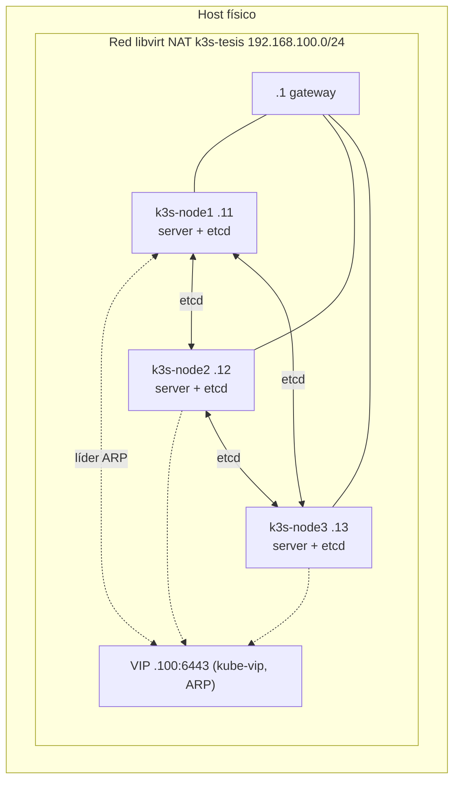

# K3s — clúster de Alta Disponibilidad

Ver también: [README raíz del proyecto](../README.md) · [README de MicroK8s](../microk8sHA/README.md).

## 1. Propósito y alcance

Este directorio contiene la infraestructura como código (Terraform + Ansible) para aprovisionar un clúster K3s de 3 nodos en Alta Disponibilidad, con etcd embebido y acceso redundante al plano de control vía kube-vip. Cubre los requisitos RF-01, RF-03 y RF-05 del proyecto (ver [README raíz, §14](../README.md#14-trazabilidad-requisito--implementación)).

## 2. Arquitectura



Los 3 nodos son `server` con etcd embebido; no hay nodos `agent` separados. kube-vip corre como DaemonSet en los 3, y el pod que gana la elección de líder asume la VIP en su interfaz real.

## 3. Estructura de carpetas

```
k3sHA/
├── ansible/
│   ├── ansible.cfg
│   ├── playbook.yml
│   ├── group_vars/all.yml         # versiones fijadas: k3s_version, kube_vip_version, puerto, interfaz
│   └── roles/
│       ├── common/                # swap off, módulos de kernel, sysctl
│       ├── ssh_config/            # hardening SSH
│       ├── k3s_server/            # instalación y unión de nodos K3s
│       └── kube_vip/              # manifiesto RBAC + DaemonSet de kube-vip
├── terraform/
│   ├── main.tf                    # red, volúmenes, cloud-init, dominios libvirt, pinning de CPU
│   ├── variables.tf
│   ├── provider.tf
│   ├── terraform.tf                # versiones de providers fijadas
│   └── config/
│       ├── cloud-init.cfg
│       ├── network-config.cfg
│       └── vcpupin.xsl.tftpl       # XSLT de pinning de CPU
├── keys/                          # llaves SSH generadas localmente — no versionadas
├── nat_on.sh / nat_off.sh         # NAT temporal opcional del host hacia la red de las VMs
├── limpia_fingerprint.sh          # limpia known_hosts y valida conectividad
└── .gitignore
```

## 4. Prerrequisitos y variables

Prerrequisitos: ver [README raíz, §10](../README.md#10-reproducibilidad).

### Variables de Terraform (`terraform/variables.tf`)

| Variable | Valor por defecto | Descripción |
|---|---|---|
| `vm_count` | `3` | Número de nodos |
| `vm_memory` | `4096` (MB) | RAM por nodo |
| `vm_cpu` | `2` | vCPU por nodo |
| `vm_disk_size` | `50` (GB) | Disco raíz |
| `network_name` | `k3s-tesis` | Nombre de la red libvirt |
| `network_cidr` | `192.168.100.0/24` | |
| `base_image` | *(sin valor por defecto, obligatorio en `terraform.tfvars`)* | Ruta a la imagen cloud de Ubuntu 24.04 LTS |
| `cluster_user` | *(sin valor por defecto, obligatorio en `terraform.tfvars`)* | Usuario administrativo de las VMs |
| `vip_address` | `192.168.100.100` | VIP del plano de control |
| `vm_names` | `["k3s-node1", "k3s-node2", "k3s-node3"]` | |
| `vm_ips` | `["192.168.100.11", "192.168.100.12", "192.168.100.13"]` | |

### Variables de Ansible (`ansible/group_vars/all.yml`)

| Variable | Valor | Descripción |
|---|---|---|
| `k3s_version` | `v1.36.3+k3s1` | Versión de K3s, fijada |
| `kube_vip_version` | `v0.8.9` | Tag de imagen de kube-vip, fijado |
| `kube_vip_interface` | `ens3` | Interfaz donde kube-vip anuncia la VIP |
| `kube_vip_port` | `6443` | Puerto de la API de K3s |

## 5. Despliegue paso a paso

```bash
cd k3sHA
ssh-keygen -t ed25519 -f keys/key -N ""

cat > terraform/terraform.tfvars <<EOF
base_image   = "<ruta_a_imagen_ubuntu_24.04>"
cluster_user = "<usuario_admin>"
EOF

cd terraform
terraform init
terraform apply
cd ..
```
**Verificación:** `virsh list --all` debe mostrar `k3s-node1/2/3` en estado `running`; `virsh domifaddr k3s-node1` debe reportar `192.168.100.11`.

```bash
./limpia_fingerprint.sh
```
**Verificación:** el script termina con `ansible -i ansible/inventory.ini all -m ping` exitoso en los 3 nodos.

```bash
cd ansible
ansible-playbook playbook.yml
```
**Verificación:** `PLAY RECAP` con `failed=0` en los 3 nodos.

```bash
ssh -i keys/key <usuario_admin>@192.168.100.100 kubectl get nodes -o wide
```
**Verificación:** 3 nodos en estado `Ready`, rol `control-plane,etcd`.

## 6. Componentes y configuración clave

| Componente | Configuración | Justificación |
|---|---|---|
| Instalación de K3s | Script oficial `get.k3s.io`, versión fijada vía `INSTALL_K3S_VERSION` | Reproducibilidad (RNF-04) |
| Primer nodo | `--cluster-init`, inicializa etcd | Requisito de bootstrap de etcd embebido en K3s |
| Nodos adicionales | Se unen directamente a `k3s-node1` (no vía VIP) con `--server https://<ip-node1>:6443 --token <token>` | Durante el bootstrap inicial solo el primer servidor tiene etcd inicializado; unirse por la VIP podría enrutar el *join* hacia un nodo aún no listo (`k3sHA/ansible/roles/k3s_server/tasks/main.yml:78-85`) |
| `--tls-san` | Lista dinámica: VIP + IP real de cada nodo del grupo `k3s_cluster`, construida en tiempo de ejecución con Jinja | Sobrevive cualquier renumeración de IPs sin editar el rol (`k3sHA/ansible/roles/k3s_server/tasks/main.yml:18-24`) |
| `--bind-address` | **Ausente** (API en wildcard `0.0.0.0`) | Obligatorio para kube-vip en modo ARP: si la API solo escuchara en la IP propia del nodo, nadie respondería en `<VIP>:6443` cuando ese nodo es el líder |
| `--disable traefik --disable servicelb` | Deshabilitados explícitamente | Ver hallazgo en [§8](#8-hallazgos-e-incidentes) |
| kube-vip | Manifiesto dejado en `/var/lib/rancher/k3s/server/manifests/kube-vip.yaml`, aplicado automáticamente por el controlador de manifiestos integrado de K3s | K3s no requiere `kubectl apply` manual (`k3sHA/ansible/roles/kube_vip/tasks/main.yml:10-15`) |
| kube-vip — modo | ARP, `cp_enable=true`, `svc_enable=false` | Ver [D-05 del README raíz](../README.md#7-registro-de-decisiones-técnicas); función de servicio deshabilitada, ver [§8](#8-hallazgos-e-incidentes) |

## 7. Decisiones propias de la distribución

| ID | Decisión | Referencia raíz |
|---|---|---|
| D-K3S-01 | Nodos adicionales se unen directamente al primer servidor, no vía VIP, durante el bootstrap inicial | Complementa D-05 |
| D-K3S-02 | `--tls-san` dinámico, no hardcodeado, construido a partir del inventario | Complementa D-01, D-07 |
| D-K3S-03 | API en wildcard (sin `--bind-address`) | Requisito derivado de D-05 (kube-vip ARP) |
| D-K3S-04 | `--disable traefik --disable servicelb` | Ver hallazgo en §8 |
| D-K3S-05 | kube-vip se auto-aplica vía el directorio de manifiestos de K3s, sin `kubectl apply` manual | Particularidad de K3s frente a MicroK8s (ver tabla de asimetrías del README raíz, §11) |

## 8. Hallazgos e incidentes

Durante la migración de Keepalived+HAProxy a kube-vip se encontró y corrigió lo siguiente (commit `8cd4c3d`):

- **Traefik + ServiceLB rompían kube-vip.** K3s instala Traefik por defecto, que crea automáticamente un `Service` tipo `LoadBalancer`. Con la función de servicio de kube-vip habilitada (`svc_enable=true`), sin un *pool* de IP configurado, kube-vip le asignó por error la IP del propio nodo a ese `Service`, pisando la IP real asignada por DHCP y dejando al nodo sin conectividad. **Solución:** se agregó `--disable traefik --disable servicelb` a la instalación (Traefik tampoco es parte del diseño: la aplicación de referencia es NGINX mínimo) y se deshabilitó `svc_enable` en el manifiesto de kube-vip hasta implementar la aplicación de referencia con un *pool* de IP explícito. Código: `k3sHA/ansible/roles/k3s_server/tasks/main.yml:35-39`, `k3sHA/ansible/roles/kube_vip/templates/kube-vip.yaml.j2:95-105`.
- **`--bind-address` incompatible con kube-vip ARP.** La configuración original fijaba `--bind-address` a la IP propia del nodo (para convivir con HAProxy, que ya no existe). Con kube-vip en modo ARP, la VIP resuelve por ARP a la MAC del nodo líder; si la API solo escucha en su IP propia, nadie responde en `<VIP>:6443`. **Solución:** se quitó el flag, la API queda en wildcard. Código: `k3sHA/ansible/roles/k3s_server/tasks/main.yml:30-39`.

## 9. Criterios de aceptación propios

| ID | Criterio | Verificación | Estado |
|---|---|---|---|
| AC-K3S-01 | 3 nodos en estado `Ready` con rol `control-plane,etcd` | `kubectl get nodes -o wide` | Declarado por el autor |
| AC-K3S-02 | etcd embebido saludable, 3 miembros | `k3s etcd-snapshot save` o listado de miembros vía `kubectl -n kube-system get pods -l component=etcd` (no hay tarea automatizada de esta verificación en el repo) | Pendiente de automatizar — verificación manual declarada por el autor |
| AC-K3S-03 | La API responde directo en la VIP, puerto 6443, sin proxy intermedio | `ssh <VIP> kubectl get nodes` (task `Esperar API de k3s en el VIP`, `k3sHA/ansible/playbook.yml:19-24`) | Cumplido con evidencia (tarea de espera pasa en el playbook) |
| AC-K3S-04 | Pod de kube-vip `Running` en los 3 nodos | `kubectl -n kube-system get pods -l name=kube-vip-ds -o wide` | Declarado por el autor |
| AC-K3S-05 | Failover real de la VIP al matar el nodo líder | `systemctl kill -s SIGKILL k3s` en el nodo con la VIP, confirmar migración | **Cumplido con evidencia** (declarado por el autor; único de las dos distribuciones donde esto se validó) |

## 10. Validación de Alta Disponibilidad

Procedimiento (protocolo de fallo controlado del diseño de Etapa 2): identificar el nodo que actualmente sostiene la VIP, ejecutar `systemctl kill -s SIGKILL k3s` en ese nodo, y confirmar que kube-vip migra la VIP a otro de los 3 nodos sin pérdida prolongada de acceso. **Estado: validado según el autor.** No hay en el repo un script ni un registro (log, captura) de esta prueba — es una afirmación del autor, no evidencia versionada.

## 11. Diferencias con MicroK8s

Ver tabla completa de asimetrías en el [README raíz, §11](../README.md#11-asimetrías-documentadas-entre-k3s-y-microk8s-rnf-03). En resumen: K3s no requirió ninguno de los cinco *workarounds* operativos que sí fueron necesarios en MicroK8s para estabilizar el arranque HA (ver [`microk8sHA/README.md`](../microk8sHA/README.md)).

## 12. Limitaciones y trabajo pendiente

- Sin observabilidad (Scaphandre, Node Exporter, Prometheus, kube-state-metrics, chrony): no implementada en este módulo.
- Sin aplicación de referencia ni pruebas de carga.
- `AC-K3S-02` (verificación de salud de etcd) no está automatizada; requiere inspección manual.
- La función de `Service` LoadBalancer de kube-vip (VIP `.150`) queda deshabilitada hasta la implementación de la aplicación de referencia.

## 13. Solución de problemas

Incidentes reales encontrados y su resolución, ambos ya incorporados al código (no requieren acción del usuario en una corrida nueva):

| Síntoma | Causa | Solución aplicada |
|---|---|---|
| El nodo pierde conectividad de red poco después de que kube-vip queda `Running` | Traefik + ServiceLB de K3s crean un `Service LoadBalancer`; kube-vip le asigna la IP del propio nodo | `--disable traefik --disable servicelb` + `svc_enable=false` en kube-vip (ver §8) |
| La API no responde en la VIP aunque el pod de kube-vip esté `Running` | `--bind-address` fijado a la IP propia del nodo, incompatible con ARP | Se quitó `--bind-address` de la instalación (ver §8) |
