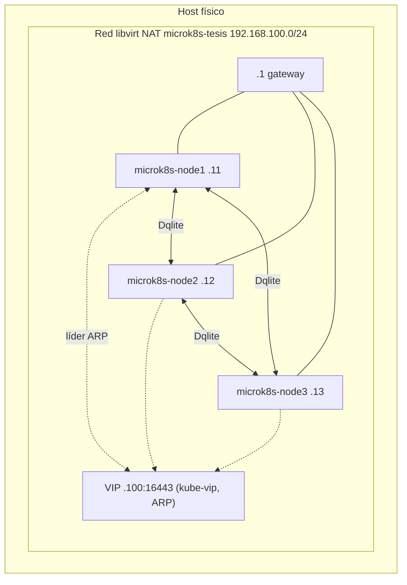

# MicroK8s — clúster de Alta Disponibilidad

Ver también: [README raíz del proyecto](../README.md) · [README de K3s](../k3sHA/README.md).

## 1. Propósito y alcance

Este directorio contiene la infraestructura como código (Terraform + Ansible) para aprovisionar un clúster MicroK8s de 3 nodos en Alta Disponibilidad, con Dqlite como *datastore* y acceso redundante al plano de control vía kube-vip. Cubre los requisitos RF-02, RF-03 y RF-05 del proyecto (ver [README raíz, §14](../README.md#14-trazabilidad-requisito--implementación)).

## 2. Arquitectura



Los 3 nodos son plano de control (`microk8s_worker_flag: false`); Dqlite activa HA automáticamente al llegar a 3 miembros. kube-vip corre como DaemonSet en los 3 nodos, igual que en K3s.

## 3. Estructura de carpetas

```
microk8sHA/
├── ansible/
│   ├── ansible.cfg
│   ├── playbook.yml
│   ├── group_vars/all.yml         # canal de MicroK8s, hold del snap, versión de kube-vip, puerto, interfaz
│   └── roles/
│       ├── common/                # swap off, módulos de kernel, sysctl
│       ├── ssh_config/            # hardening SSH
│       ├── microk8s_server/       # instalación, join, hallazgos de estabilización (§8)
│       └── kube_vip/              # manifiesto RBAC + DaemonSet de kube-vip
├── terraform/
│   ├── main.tf                    # red, volúmenes, cloud-init, dominios libvirt, pinning de CPU
│   ├── variables.tf
│   ├── provider.tf
│   ├── terraform.tf                # versiones de providers fijadas
│   └── config/
│       ├── cloud-init.cfg
│       ├── network-config.cfg
│       └── vcpupin.xsl.tftpl       # XSLT de pinning de CPU
├── keys/                          # llaves SSH generadas localmente — no versionadas
├── nat_on.sh / nat_off.sh         # NAT temporal opcional del host hacia la red de las VMs
├── limpia_fingerprint.sh          # limpia known_hosts y valida conectividad
└── .gitignore
```

## 4. Prerrequisitos y variables

Prerrequisitos: ver [README raíz, §10](../README.md#10-reproducibilidad).

### Variables de Terraform (`terraform/variables.tf`)

| Variable | Valor por defecto | Descripción |
|---|---|---|
| `vm_count` | `3` | Número de nodos |
| `vm_memory` | `4096` (MB) | RAM por nodo |
| `vm_cpu` | `2` | vCPU por nodo |
| `vm_disk_size` | `50` (GB) | Disco raíz |
| `network_name` | `microk8s-tesis` | Nombre de la red libvirt |
| `network_cidr` | `192.168.100.0/24` | |
| `base_image` | *(sin valor por defecto, obligatorio en `terraform.tfvars`)* | Ruta a la imagen cloud de Ubuntu 24.04 LTS |
| `cluster_user` | *(sin valor por defecto, obligatorio en `terraform.tfvars`)* | Usuario administrativo de las VMs |
| `vip_address` | `192.168.100.100` | VIP del plano de control |
| `vm_names` | `["microk8s-node1", "microk8s-node2", "microk8s-node3"]` | |
| `vm_ips` | `["192.168.100.11", "192.168.100.12", "192.168.100.13"]` | |

### Variables de Ansible (`ansible/group_vars/all.yml`)

| Variable | Valor | Descripción |
|---|---|---|
| `microk8s_channel` | `1.36/stable` | Canal snap — **no es una versión exacta**, ver [README raíz, §13](../README.md#13-limitaciones-y-amenazas-a-la-validez) |
| `snap_refresh_timer` | `forever` | `snap refresh --hold=forever`, congela la revisión tras el primer install |
| `microk8s_worker_flag` | `false` | Los 3 nodos son plano de control, sin *workers* dedicados |
| `microk8s_extra_sans` | `["{{ vip_address }}"]` | SAN adicional en los certificados del API server |
| `kube_vip_version` | `v0.8.9` | Tag de imagen de kube-vip, fijado (idéntico a K3s) |
| `kube_vip_interface` | `ens3` | Interfaz donde kube-vip anuncia la VIP |
| `kube_vip_port` | `16443` | Puerto de la API de MicroK8s |

## 5. Despliegue paso a paso

```bash
cd microk8sHA
ssh-keygen -t ed25519 -f keys/key -N ""

cat > terraform/terraform.tfvars <<EOF
base_image   = "<ruta_a_imagen_ubuntu_24.04>"
cluster_user = "<usuario_admin>"
EOF

cd terraform
terraform init
terraform apply
cd ..
```
**Verificación:** `virsh list --all` debe mostrar `microk8s-node1/2/3` en estado `running`.

```bash
./limpia_fingerprint.sh
```
**Verificación:** `ansible -i ansible/inventory.ini all -m ping` exitoso en los 3 nodos.

```bash
cd ansible
ansible-playbook playbook.yml
```
**Verificación:** `PLAY RECAP` con `failed=0` en los 3 nodos. El primer arranque de cada nodo puede tardar varios minutos (ver §8); los *timeouts* del playbook ya están ajustados a esto.

```bash
ssh -i keys/key <usuario_admin>@192.168.100.100 microk8s kubectl get nodes -o wide
```
**Verificación:** 3 nodos en estado `Ready`.

## 6. Componentes y configuración clave

| Componente | Configuración | Justificación |
|---|---|---|
| Instalación | `snap install microk8s --classic --channel={{ microk8s_channel }}` | Canal fijado para alinear la serie de Kubernetes con la versión de K3s (comparación justa) |
| *Join* de nodos | Token de un solo uso generado en `microk8s-node1` vía `microk8s add-node --token-ttl 3600`, consumido con `microk8s join` | Mecanismo propio de MicroK8s; se delega siempre al primer nodo |
| `--bind-address`/`--advertise-address` | Removidos del `kube-apiserver` si existían de una instalación previa | La API debe quedar en wildcard (`16443`) para que kube-vip en ARP pueda responder en la VIP — mismo motivo que en K3s |
| kube-vip | Manifiesto aplicado explícito con `microk8s kubectl apply`, no hay directorio de auto-aplicado como en K3s | Particularidad de MicroK8s (`microk8sHA/ansible/roles/kube_vip/tasks/main.yml:13-27`) |
| kube-vip — modo | ARP, `cp_enable=true`, `svc_enable=false` | Igual que K3s — ver [D-05 del README raíz](../README.md#7-registro-de-decisiones-técnicas) |
| `apiserver-kicker` | Enmascarado (`systemctl mask`) después del primer arranque completo del nodo | Ver hallazgo 1 en [§8](#8-hallazgos-e-incidentes) |

## 7. Decisiones propias de la distribución

| ID | Decisión | Referencia raíz |
|---|---|---|
| D-MK8S-01 | Dqlite activa Alta Disponibilidad automáticamente al llegar a 3 miembros, sin configuración manual adicional | Complementa D-05 |
| D-MK8S-02 | `apiserver-kicker` se enmascara recién después del primer arranque completo del nodo, nunca antes | Ver hallazgo 1, §8 |
| D-MK8S-03 | `microk8s refresh-certs -e server.crt` + reinicio inmediatamente después de cada `join` | Ver hallazgo 3, §8 |
| D-MK8S-04 | `throttle: 1` en la tarea de unión de nodos | Ver hallazgo 4, §8 |
| D-MK8S-05 | *Timeouts* de `microk8s status --wait-ready` extendidos de 120-300 s a 600-900 s en seis puntos del rol | Ver hallazgo 5, §8 |
| D-MK8S-06 | kube-vip se aplica explícito con `kubectl apply`, no hay auto-aplicado | Particularidad de MicroK8s frente a K3s (ver tabla de asimetrías del README raíz, §11) |

## 8. Hallazgos e incidentes

Durante la implementación de kube-vip sobre MicroK8s se encontraron cinco problemas específicos de esta distribución, ninguno presente en K3s con el mismo hardware y el mismo mecanismo de kube-vip. Todos quedaron corregidos en el código (commit `8cd4c3d`).

| # | Síntoma | Causa raíz | Solución | Dónde en el código |
|---|---|---|---|---|
| 1 | Reinicio en cascada de todos los *daemons* de MicroK8s, de varios minutos, al desplegar kube-vip | `apiserver-kicker` (daemon interno de MicroK8s) vigila las IPs de las interfaces del nodo y dispara regeneración de certificados + reinicio ante cualquier IP nueva, sin distinguir primaria de secundaria; kube-vip asume la VIP como dirección secundaria en la interfaz real. Problema documentado en la comunidad, sin *flag* oficial para excluir la IP (`canonical/microk8s` *issues* #1943 y #3575; `kube-vip/kube-vip` *issue* #741 — URLs no confirmadas en este README, el autor las referenció por número de *issue*) | `systemctl mask` sobre `snap.microk8s.daemon-apiserver-kicker.service`, aplicado **después** del primer arranque completo (deshabilitarlo antes impide que Calico termine su propio despliegue) | `microk8sHA/ansible/roles/microk8s_server/tasks/main.yml:41-63` |
| 2 | `sudo` tardaba ~15 s en cada invocación; los *wrappers* de systemd de cada *daemon* de MicroK8s hacen decenas de `sudo` secuenciales al arrancar, multiplicando la demora a varios minutos | `/etc/hosts` sin entrada propia: `sudo` cae a resolución DNS del *hostname* propio y espera el *timeout* completo | `manage_etc_hosts: true` en `cloud-init`; medido: de ~15 s a ~0,008 s por invocación | `microk8sHA/terraform/config/cloud-init.cfg:5-9` |
| 3 | `microk8s status --wait-ready` nunca completaba tras un `join`, aunque los *daemons* (`kubelite`, `k8s-dqlite`) estuvieran activos y estables; `kubectl get nodes` fallaba con `x509: certificate signed by unknown authority` | El `server.crt` del nodo recién unido queda firmado por la CA de su propio arranque en solitario (previo al `join`), no por la CA compartida del clúster — el `ca.crt` en disco sí coincide entre nodos, pero el certificado realmente servido no | `microk8s refresh-certs -e server.crt` + `snap restart microk8s`, inmediatamente después de cada `join` | `microk8sHA/ansible/roles/microk8s_server/tasks/main.yml:154-171` |
| 4 | Al unir los nodos 2 y 3 en paralelo (comportamiento por defecto de Ansible), ambos *joins* fallaban con errores de Dqlite (`failed waiting for dqlite cluster to come up`, `failed to restart k8s-dqlite service`) | Dqlite no tolera dos cambios de membresía simultáneos al mismo clúster | `throttle: 1` en la tarea de `join` (solo esa tarea se serializa, no el *play* completo) | `microk8sHA/ansible/roles/microk8s_server/tasks/main.yml:141-152` |
| 5 | El primer arranque en frío (*pull* de imágenes de Calico) podía tardar casi 10 minutos en una VM de 2 vCPU, superando los *timeouts* originales de 120-300 s | *Timeouts* insuficientes para el primer arranque, no un problema de configuración | *Timeouts* de `microk8s status --wait-ready` extendidos a 600-900 s en los seis puntos de espera del rol | `microk8sHA/ansible/roles/microk8s_server/tasks/main.yml` (líneas 37, 93, 177, 215) y `microk8sHA/ansible/roles/kube_vip/tasks/main.yml` (líneas 9, 32) |

**Dato de esfuerzo — declarado por el autor, no verificable en el repo:** la tarea T-14.2 del *backlog* ("Instalar MicroK8s en los tres nodos") se estimó en 4 h y tomó 8 h reales; no hay un sobrecosto equivalente registrado para la tarea análoga de K3s (T-13.1/T-13.2). No existe en el repositorio un registro de tiempos con esa granularidad que permita verificar esta cifra de forma independiente.

## 9. Criterios de aceptación propios

| ID | Criterio | Verificación | Estado |
|---|---|---|---|
| AC-MK8S-01 | 3 nodos en estado `Ready` | `microk8s kubectl get nodes -o wide` | Declarado por el autor |
| AC-MK8S-02 | Dqlite en Alta Disponibilidad con 3 miembros | `microk8s status` → `high-availability: yes`, `datastore master nodes: 3` (no hay tarea automatizada de esta verificación en el repo) | Pendiente de automatizar — verificación manual declarada por el autor |
| AC-MK8S-03 | La API responde directo en la VIP, puerto 16443, sin proxy intermedio | `ssh <VIP> microk8s kubectl get nodes` (task `Esperar API de microk8s en el VIP`, `microk8sHA/ansible/playbook.yml:21-25`) | Cumplido con evidencia (tarea de espera pasa en el playbook) |
| AC-MK8S-04 | Pod de kube-vip `Running` en los 3 nodos | `microk8s kubectl -n kube-system get pods -l name=kube-vip-ds -o wide` | Declarado por el autor |
| AC-MK8S-05 | Failover real de la VIP al matar el nodo líder | `systemctl kill -s SIGKILL snap.microk8s.daemon-kubelite` en el nodo con la VIP, confirmar migración | **Cumplido con evidencia** (declarado por el autor) |

## 10. Validación de Alta Disponibilidad

Procedimiento (protocolo de fallo controlado de Etapa 2): identificar el nodo que sostiene la VIP, ejecutar `systemctl kill -s SIGKILL snap.microk8s.daemon-kubelite` en ese nodo, confirmar migración de la VIP. **Estado: validado según el autor.** No hay en el repo un script ni un registro (log, captura) de esta prueba — es una afirmación del autor, no evidencia versionada.

## 11. Diferencias con K3s

Ver tabla completa de asimetrías en el [README raíz, §11](../README.md#11-asimetrías-documentadas-entre-k3s-y-microk8s-rnf-03). En resumen: MicroK8s requirió cinco correcciones operativas propias (§8) que K3s no necesitó; el *failover* de VIP está validado en ambas distribuciones.

## 12. Limitaciones y trabajo pendiente

- Sin observabilidad (Scaphandre, Node Exporter, Prometheus, kube-state-metrics, chrony): no implementada en este módulo.
- Sin aplicación de referencia ni pruebas de carga.
- `AC-MK8S-02` (verificación de salud de Dqlite) no está automatizada; requiere inspección manual.
- La función de `Service` LoadBalancer de kube-vip (VIP `.150`) queda deshabilitada hasta la implementación de la aplicación de referencia.
- El canal `1.36/stable` no fija una revisión exacta de antemano (ver [README raíz, §13](../README.md#13-limitaciones-y-amenazas-a-la-validez)).

## 13. Solución de problemas

Los cinco incidentes reales de esta sección ya están incorporados al código (§8) y no requieren acción del usuario en una corrida nueva; se documentan aquí a modo de referencia rápida por síntoma.

| Síntoma al correr el playbook | Ir a |
|---|---|
| Reinicios en cascada de varios minutos tras aplicar kube-vip | Hallazgo 1, §8 |
| `sudo` visiblemente lento, tareas que tardan mucho más de lo esperado | Hallazgo 2, §8 |
| `microk8s status --wait-ready` nunca termina tras un *join*, o `x509: certificate signed by unknown authority` | Hallazgo 3, §8 |
| Ambos nodos adicionales fallan el *join* al mismo tiempo con errores de Dqlite | Hallazgo 4, §8 |
| *Timeout* durante el primer arranque, sin otro error visible | Hallazgo 5, §8 |
