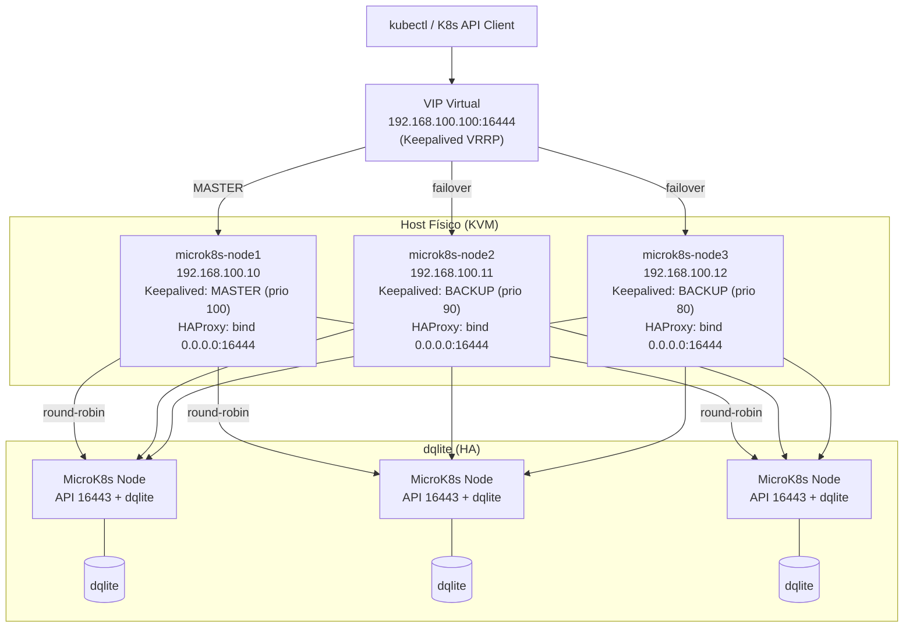

# microk8s High Availability Cluster

Implementación automatizada de un clúster **MicroK8s en alta disponibilidad (HA)** sobre máquinas virtuales **libvirt/KVM** usando **Terraform** y **Ansible**, diseñada expresamente para **medir el consumo energético de Kubernetes en recursos limitados** al ejecutar una aplicación bajo estrés, sin interferencia de la capa de virtualización de red.

Es el gemelo de `k3sHA/`: misma infraestructura, mismo diseño HA, pero con MicroK8s (snap) para **comparar el consumo energético de ambos runtimes** en condiciones bit-idénticas.

## Arquitectura



### Flujo de despliegue

```mermaid
sequenceDiagram
    participant T as Terraform
    participant L as libvirt/KVM
    participant CI as Cloud-Init
    participant A as Ansible
    participant N1 as microk8s-node1
    participant N2 as microk8s-node2
    participant N3 as microk8s-node3

    T->>L: Crear red virtual (192.168.100.0/24)
    T->>L: Importar imagen base Ubuntu 22.04
    T->>L: Crear 3 volúmenes qcow2
    T->>CI: Generar cloud-init (hostname, IP estática, SSH key)
    T->>L: Crear 3 dominios KVM con cloud-init
    L->>N1: Boot VM + cloud-init
    L->>N2: Boot VM + cloud-init
    L->>N3: Boot VM + cloud-init
    T->>A: Generar ansible/inventory.ini

    A->>N1: common (swap off, módulos kernel, sysctl)
    A->>N2: common
    A->>N3: common
    A->>N1: ssh_config (key auth, no root, no password)
    A->>N2: ssh_config
    A->>N3: ssh_config
    A->>N1: keepalived (MASTER, prio 100)
    A->>N2: keepalived (BACKUP, prio 90)
    A->>N3: keepalived (BACKUP, prio 80)
    A->>N1: haproxy (bind 0.0.0.0:16444)
    A->>N2: haproxy (bind 0.0.0.0:16444)
    A->>N3: haproxy (bind 0.0.0.0:16444)
    A->>N1: snap install microk8s (channel fijo) + enable dns/storage
    A->>N1: microk8s add-node (token de un solo uso)
    N1-->>A: microk8s_join_command
    A->>N2: microk8s join Node1 (token)
    A->>N3: microk8s join Node1 (token)
    Note over N1,N3: Clúster HA formado (dqlite)
    A->>N1,N2,N3: SANs del VIP en csr.conf.template + refresh-certs
    A->>N1: kubeconfig → https://VIP:16444
```

## Diseño de red

La red virtual libvirt se configura en **modo route** (no NAT). Esto es intencional: el objetivo principal de esta implementación es **medir el consumo energético de Kubernetes** al ejecutar una aplicación bajo estrés. Una red en modo NAT agregaría procesamiento adicional de traducción de direcciones (SNAT/DNAT) en cada paquete, introduciendo ruido en las mediciones de potencia. Con modo route, el host enruta los paquetes sin modificarlos, aislando el overhead de red y asegurando que las lecturas de consumo reflejen únicamente la carga del clúster y la aplicación, no la virtualización de red.

La conectividad a internet para las VMs es opcional y se habilita bajo demanda con `nat_on.sh`, exclusivamente para tareas que lo requieran (como descargar el snap de MicroK8s), sin permanecer activa durante las pruebas de energía.

## Puertos: API server vs Load Balancer

| Puerto | Dueño | Detalle |
|---|---|---|
| `16443` | kube-apiserver (kubelite) | Puerto nativo de MicroK8s, escucha en wildcard `*:16443` |
| `16444` | HAProxy | Frontend del LB, escucha en `0.0.0.0:16444`, balancea hacia los 3 nodos en `16443` |

**Por qué puertos distintos:** en Linux (verificado empíricamente con sockets Python en host y VM con kernel `5.15.0-171-generic`), un puerto admite **un solo listener**: si HAProxy escucha en `0.0.0.0:16443`, un bind específico `IP:16443` (o wildcard) del kube-apiserver falla con `EADDRINUSE`. Un intento previo de fijar `--bind-address` al apiserver provocó que `snap.microk8s.daemon-kubelite` quedara `inactive/failed` (log: `bind: address already in use`) y HAProxy reportara `Connect() failed ... no free ports`.

La solución es separar puertos: HAProxy recibe en `16444` y reenvía al API real en `16443`. El apiserver queda en su wildcard nativo, por lo que `microk8s status`, `microk8s kubectl` y `snap.microk8s.daemon-kubelite` funcionan localmente en cada nodo. El kubeconfig externo apunta a `https://192.168.100.100:16444`.

## Modelo conceptual (tabla de variables de la tesis)

Las variables del clúster se definen en `ansible/group_vars/all.yml` y mapean el modelo conceptual del trabajo:

| Variable | Valor usado | Significado |
|---|---|---|
| `microk8s_channel` | `1.36/stable` | Canal snap fijado en la instalación. Alinea la versión con k3s `v1.36.3+k3s1` para comparación justa de consumo (MicroK8s desplegado: v1.36.2). |
| `microk8s_join_command` | *(dinámico)* | Token de unión obtenido con `microk8s add-node` en el nodo 1 (un token de un solo uso por nodo). El join se delega al nodo principal, no al VIP. |
| `microk8s_worker_flag` | `false` | `false` = el nodo se une como plano de control (dqlite, HA). `true` agrega `--worker` (cómputo puro, no toca el quórum). |
| `microk8s_extra_sans` | `[192.168.100.100]` | IPs adicionales en `csr.conf.template` → se regeneran los certificados del API server (`refresh-certs -e server.crt`) para que validen el VIP del LB. |
| `snap_refresh_timer` | `forever` | `snap refresh --hold=forever microk8s`: congela el revision del snap (con `package_upgrade: false` en cloud-init, el entorno queda bit-idéntico entre reconstrucciones). |

## Prerrequisitos

| Requisito | Versión |
|---|---|
| Linux con KVM/libvirt | cualquiera con `virsh` funcional |
| Terraform | >= 1.0 |
| Ansible | >= 2.9 |
| Imagen cloud Ubuntu 22.04 | `jammy-server-cloudimg-amd64.img` |
| Python + `python3-pip` | para `pylibvirt` si es necesario |

## Estructura del proyecto

```
microk8sHA/
├── ansible/
│   ├── ansible.cfg          # Configuración global de Ansible
│   ├── playbook.yml          # Playbook principal (2 plays)
│   ├── group_vars/all.yml    # Variables conceptuales (canal, worker, SANs, refresh)
│   └── roles/
│       ├── common/           # Swap off, kernel modules, sysctl
│       ├── haproxy/          # HAProxy TCP LB (frontend 16444 → backend 16443)
│       ├── keepalived/       # Keepalived VRRP + VIP
│       ├── microk8s_server/  # Instalación snap + join + SANs + kubeconfig
│       └── ssh_config/       # Hardening de SSH
├── terraform/
│   ├── config/
│   │   ├── cloud-init.cfg    # Template user-data (Jinja2)
│   │   └── network-config.cfg # Template netplan (Jinja2)
│   ├── main.tf               # Recursos libvirt + inventario
│   ├── provider.tf           # Provider libvirt
│   ├── terraform.tf          # Versiones y providers
│   ├── variables.tf          # Variables con defaults
│   └── limpia.sh             # Destrucción total
├── nat_on.sh                 # Activar NAT para VMs
├── nat_off.sh                # Desactivar NAT para VMs
├── limpia_fingerprint.sh     # Limpiar known_hosts y test SSH
└── .gitignore
```

> **Nota:** `ansible/inventory.ini` es generado automáticamente por Terraform. Las claves SSH deben generarse localmente (ver instalación).

## Instalación

### 1. Clonar el repositorio

```bash
git clone <tu-repo-url>
cd microk8sHA
```

### 2. Generar claves SSH

```bash
ssh-keygen -t ed25519 -f keys/key -N ""
```

### 3. Crear archivo de variables locales (no se sube a git)

Las variables `base_image` y `cluster_user` no tienen valor por defecto. Crea `terraform/terraform.tfvars` (está en `.gitignore`):

```hcl
base_image   = "/ruta/a/jammy-server-cloudimg-amd64.img"
cluster_user = "jdelpino"
```

### 4. Preparar imagen base

```bash
wget https://cloud-images.ubuntu.com/jammy/current/jammy-server-cloudimg-amd64.img
```

### 5. Crear infraestructura con Terraform

```bash
cd terraform
terraform init
terraform apply -auto-approve
cd ..
```

Esto crea:
- Red libvirt (192.168.100.0/24, modo route)
- 3 VMs (microk8s-node1, microk8s-node2, microk8s-node3) con IPs estáticas
- Cloud-init configurando hostname, usuario del clúster y llave SSH
- Archivo `ansible/inventory.ini` con variables de keepalived, haproxy y usuario

### 6. Habilitar NAT (opcional, para internet en VMs)

```bash
./nat_on.sh
```

El primer arranque de MicroK8s descarga el snap desde snapstore, por lo que se recomienda activar NAT antes del playbook.

### 7. Limpiar fingerprints y probar conectividad

```bash
./limpia_fingerprint.sh
```

### 8. Ejecutar Ansible

```bash
cd ansible
ansible-playbook playbook.yml
```

Este playbook:
1. **Nodo 1:** Aplica common → ssh_config → keepalived (MASTER) → haproxy (bind 0.0.0.0:16444) → microk8s_server (snap install `--channel` + `--hold`, `enable dns storage`)
2. **Nodos 2 y 3:** Aplica common → ssh_config → keepalived (BACKUP) → haproxy → microk8s_server (genera token vía `microk8s add-node` delegado al nodo 1 y ejecuta el join)

Los masters adicionales se unen **directamente al nodo 1** (no al VIP): el token se obtiene con `microk8s add-node` (un solo uso, delegado al nodo principal) y el join se ejecuta solo cuando el snap se instaló en esa corrida (idempotencia). En estado estable los 3 nodos son simétricos y la tolerancia a falla es idéntica (quórum dqlite 2/3).

El playbook es **idempotente y auto-reparable**: si en una corrida anterior quedaron flags `--bind-address`/`--advertise-address` legacy en `/var/snap/microk8s/current/args/kube-apiserver`, los elimina y reinicia MicroK8s (mecanismo que deja kubelite activo de nuevo).

### 9. Verificar el clúster

```bash
ssh -i keys/key jdelpino@192.168.100.10
sudo microk8s status --wait-ready
sudo microk8s kubectl get nodes -o wide
```

Desde el host (o cualquier cliente), usando el kubeconfig apuntando al VIP:

```bash
kubectl --kubeconfig <kubeconfig-de-node1> get nodes
curl -sk https://192.168.100.100:16444/healthz   # 401 esperado (API viva)
```

## Componentes

### Terraform

Crea toda la infraestructura en libvirt (mismos recursos que `k3sHA`):

| Recurso | Descripción |
|---|---|
| `libvirt_network` | Red virtual en modo route (sin NAT), DHCP desactivado — evita overhead de traducción de red que contaminaría las mediciones energéticas |
| `libvirt_volume.base_image` | Imagen base importada |
| `libvirt_volume.vm_disk` | 3 discos qcow2 de 20 GB |
| `libvirt_cloudinit_disk` | ISOs cloud-init con IP estática y SSH key |
| `libvirt_domain` | 3 VMs con 3 GB RAM, 2 vCPUs |
| `local_file` | Genera `ansible/inventory.ini` |

### Ansible roles

| Rol | Función |
|---|---|
| **common** | `swapoff`, carga `overlay`/`br_netfilter`, sysctl para K8s |
| **ssh_config** | Solo key auth, deshabilita root login, despliega llave pública |
| **keepalived** | Instala y configura VRRP con VIP `192.168.100.100` |
| **haproxy** | Balanceo TCP round-robin en puerto 16444 hacia los 3 nodos en 16443 |
| **microk8s_server** | Instala el snap (canal fijo), agrega SANs, ejecuta el join y ajusta el kubeconfig |

### Alta disponibilidad

- **Keepalived** monitorea HAProxy mediante `killall -0 haproxy`. Si HAProxy cae, la prioridad del nodo baja 2 puntos, provocando failover del VIP.
- **HAProxy** balancea en round-robin las conexiones a la API de MicroK8s (puerto 16444) hacia los 3 servidores en 16443.
- **MicroK8s** usa dqlite embebido (3 nodos plano de control), tolerando la caída de 1 nodo.
- Si el nodo MASTER con el VIP falla, otro nodo toma el VIP y HAProxy sigue distribuyendo tráfico a los servidores saludables.

> **Failover verificado:** destruir `microk8s-node1` (MASTER) deja el VIP en node2, la API sigue respondiendo por `https://192.168.100.100:16444`, node1 pasa a `NotReady` (~1 min) y node2/node3 conservan el quórum. Al reiniciar node1, se reincorpora como `Ready` y el VIP vuelve al MASTER.

## Limpieza

```bash
# Destruir VMs y recursos
cd terraform && bash limpia.sh

# Desactivar NAT
cd .. && ./nat_off.sh
```

## Variables de Terraform

| Variable | Default | Descripción |
|---|---|---|
| `vm_count` | `3` | Número de nodos |
| `vm_memory` | `3072` | RAM por VM (MB) |
| `vm_cpu` | `2` | vCPUs por VM |
| `vm_disk_size` | `20` | Disco raíz (GB) |
| `base_image` | *(obligatorio)* | Ruta a imagen cloud Ubuntu 22.04 |
| `cluster_user` | *(obligatorio)* | Usuario administrativo del clúster |
| `ssh_public_key` | `keys/key.pub` | Llave pública SSH |
| `ssh_private_key` | `../keys/key` | Ruta llave privada SSH |
| `vip_address` | `192.168.100.100` | IP virtual keepalived |
| `haproxy_bind_ip` | `0.0.0.0` | Interfaz donde HAProxy escucha (no debe depender del VIP para arrancar) |
| `vm_names` | `[microk8s-node1, ...]` | Nombres de las VMs |
| `vm_ips` | `[192.168.100.10, ...]` | IPs estáticas |
